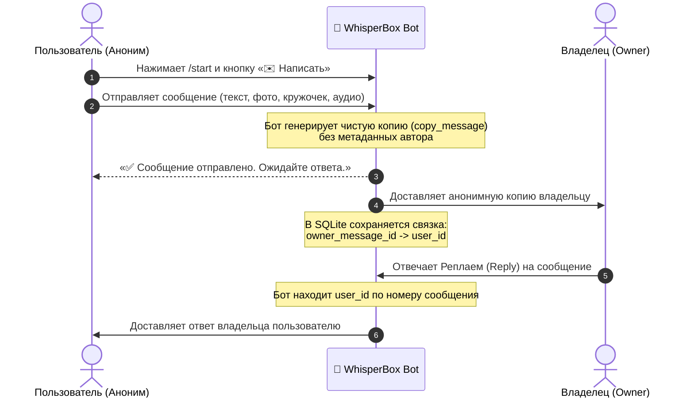

<div align="center">

# 🤫 WhisperBox Bot

**Быстрый, приватный и 100% анонимный Telegram-бот для обратной связи, признаний и вопросов**

[](https://rovel-labs.fourtopaph.workers.dev/)
[](https://www.python.org/)
[](https://aiogram.dev/)
[](https://www.sqlite.org/)
[](Dockerfile)
[](LICENSE)

<br />

🌐 **Официальный сайт лаборатории:** [rovel-labs.fourtopaph.workers.dev](https://rovel-labs.fourtopaph.workers.dev/)  
💬 **Разработано в Rovel Labs для свободного и приватного общения в Telegram.**

</div>

---

## 🌟 Ключевые возможности

| Функция | Описание |
| :--- | :--- |
| 🛡️ **Истинная анонимность** | Используется метод `copy_message` вместо `forward_message`. Владелец **не видит** профиль, @username, фото или ID отправителя. |
| 💬 **Двусторонний диалог** | Владелец отвечает обычным свайпом/реплаем в Telegram — бот моментально пересылает ответ нужному собеседнику. |
| 📸 **Любые типы контента** | Поддерживает текст, голосовые сообщения, видеосообщения (кружочки), фото, видео, стикеры и любые документы. |
| ⚡ **Асинхронный движок** | Написан на современном фреймворке **aiogram 3.x** с FSM (конечными автоматами) для мгновенной скорости обработки. |
| 💾 **Локальное хранилище** | Встроенная база SQLite (`bot.db`). В базе хранятся только числовые связки `message_id ⇄ user_id`, без текста переписок. |
| 🐳 **Быстрое развертывание** | Поддержка Docker, Docker Compose, Railway, запуск в Windows через `run.bat` или как служба systemd в Linux. |

---

## 🔄 Как устроена маршрутизация (Архитектура)



---

## 🚀 Быстрый старт

### Вариант 1: Запуск на Windows (в 1 клик)

1. Установите **[Python 3.10+](https://www.python.org/downloads/)** (при установке обязательно поставьте галочку `Add Python to PATH`).
2. Склонируйте или скачайте репозиторий:
   ```bash
   git clone https://github.com/RovelLabs/whisperbox-bot.git
   cd whisperbox-bot
   ```
3. Скопируйте файл `.env.example` в `.env`:
   ```bash
   copy .env.example .env
   ```
4. Откройте `.env` в Блокноте и укажите токен вашего бота от [@BotFather](https://t.me/BotFather) и ваш Telegram ID:
   ```env
   BOT_TOKEN=1234567890:ABCdefGhIJKlmNoPQRsTUVwxyZ
   OWNER_ID=5792274744
   ```
5. Запустите **`run.bat`** двойным кликом. Скрипт сам создаст виртуальное окружение `venv`, установит библиотеки и запустит бота!

---

### Вариант 2: Запуск через Docker / Docker Compose 🐳

```bash
# 1. Склонируйте репозиторий и перейдите в папку
git clone https://github.com/RovelLabs/whisperbox-bot.git
cd whisperbox-bot

# 2. Создайте файл окружения .env
cp .env.example .env
nano .env

# 3. Запустите контейнер в фоне
docker compose up -d --build
```

---

### Вариант 3: Деплой на Railway ☁️

В репозиторий уже встроен файл конфигурации `railway.toml`:
1. Зарегистрируйтесь на [Railway.app](https://railway.app/).
2. Создайте новый проект из GitHub-репозитория: `RovelLabs/whisperbox-bot`.
3. Во вкладке **Variables** добавьте переменные:
   - `BOT_TOKEN`: токен бота от BotFather
   - `OWNER_ID`: ваш Telegram ID
4. Railway автоматически соберет и запустит бота 24/7!

---

### Вариант 4: Запуск на Linux сервере (Systemd)

```bash
# Клонирование
git clone https://github.com/RovelLabs/whisperbox-bot.git /opt/whisperbox-bot
cd /opt/whisperbox-bot

# Окружение
python3 -m venv venv
source venv/bin/activate
pip install -r requirements.txt

# Настройка
cp .env.example .env
nano .env

# Запуск
python3 bot.py
```

---

## ⚙️ Переменные окружения (`.env`)

| Переменная | Описание | Обязательна | Пример |
| :--- | :--- | :---: | :--- |
| `BOT_TOKEN` | HTTP API токен бота, полученный у [@BotFather](https://t.me/BotFather) | **Да** | `7123456789:AAH...` |
| `OWNER_ID` | Telegram User ID администратора (узнать можно у [@userinfobot](https://t.me/userinfobot)) | **Да** | `5792274744` |

---

## 🔒 Безопасность и Приватность

1. **Никакой слежки:** Бот **не ведет логов** личных сообщений и не сохраняет текст переписок.
2. **Изолированная база:** Файл `bot.db` содержит только одну техническую таблицу:
   ```sql
   CREATE TABLE message_routes (
       owner_message_id INTEGER PRIMARY KEY,
       recipient_id INTEGER NOT NULL
   );
   ```
   В ней нет имён, юзернеймов, времени или содержимого сообщений — исключительно ID для маршрутизации ответа.
3. **Защита от утечек:** Файлы базы данных (`*.db`) и приватные ключи (`.env`) внесены в `.gitignore`.

---

## 👥 Разработчики и команда Rovel Labs

Проект создан и развивается лабораторией **[Rovel Labs](https://rovel-labs.fourtopaph.workers.dev/)**:

- **Архитектура & Продукт:** [Rovel Labs](https://rovel-labs.fourtopaph.workers.dev/)
- **Core Engine & Routing:** aiogram 3 async router engine
- **Open-Source Maintainers:** [@RovelLabs](https://github.com/RovelLabs)

Если у вас есть идеи по улучшению — создавайте [Pull Request](https://github.com/RovelLabs/whisperbox-bot/pulls) или открывайте [Issue](https://github.com/RovelLabs/whisperbox-bot/issues).

---

## 📄 Лицензия

Проект распространяется под свободной лицензией **[MIT](LICENSE)**. Вы можете свободно использовать, изменять и разворачивать бота для личных и коммерческих целей.

© 2026 **[Rovel Labs](https://rovel-labs.fourtopaph.workers.dev/)** & WhisperBox Contributors.
